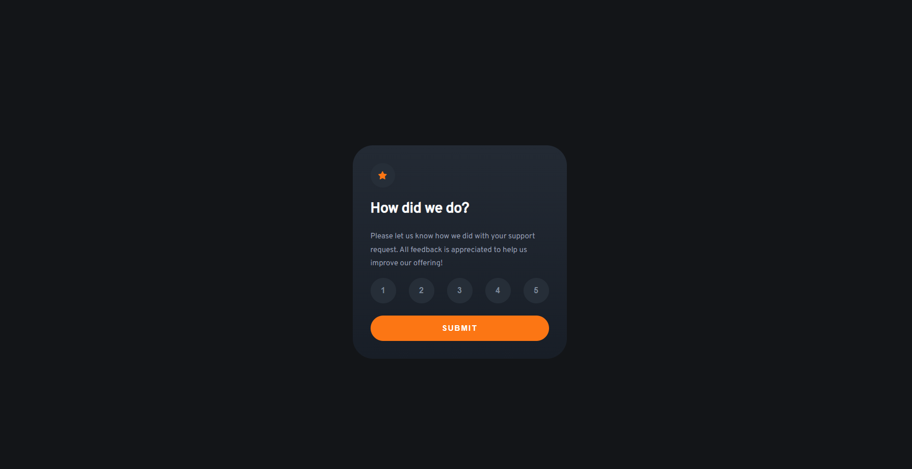

# Frontend Mentor - Interactive rating component solution

This is a solution to the [Interactive rating component challenge on Frontend Mentor](https://www.frontendmentor.io/challenges/interactive-rating-component-koxpeBUmI). 

## Table of contents

- [Overview](#overview)
  - [The challenge](#the-challenge)
  - [Screenshot](#screenshot)
  - [Links](#links)
- [My process](#my-process)
  - [Built with](#built-with)
- [Author](#author)

## Overview

### The challenge

Users should be able to:

- View the optimal layout for the app depending on their device's screen size
- See hover states for all interactive elements on the page
- Select and submit a number rating
- See the "Thank you" card state after submitting a rating

### Screenshot

### Links

- Solution URL: [Github](https://github.com/abramishvilisaba/interactive-rating-component)
- Live Site URL: [Netlfiy](https://sabramishvili-rating-app.netlify.app/)

## My process

### Built with

- Mobile-first workflow
- [Styled Components](https://styled-components.com/) - For styles
- [React](https://reactjs.org/) - JS library

## Author

- Website - [saba abramishvili](github.com/abramishvilisaba)

